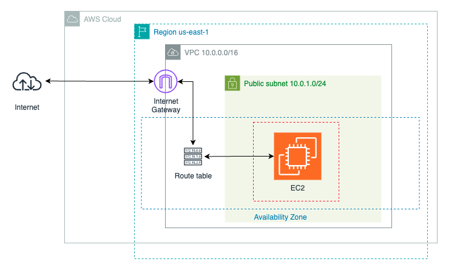

# Laboratorio Terraform: Infraestructura Básica en AWS

## Objetivo

Crear una infraestructura mínima en AWS LocalStack utilizando Terraform

## Recursos a crear

- VPC
- Subred pública
- Internet Gateway
- Tabla de rutas
- Security Group (puerto 22)
- Instancia EC2 (Amazon Linux 2)

## Requisitos

- Terraform instalado
- AWS CLI configurado
- LocalStack

## Instrucciones

1. Iniciar LocalStack 
```bash
localstack start -d
```
2. Setear variables de entorno:
```bash
export AWS_ENDPOINT_URL=http://localhost:4566
export AWS_ENDPOINT_URL_S3=http://s3.localhost.localstack.cloud:4566
export AWS_ACCESS_KEY_ID=test
export AWS_SECRET_ACCESS_KEY=test
export AWS_DEFAULT_REGION=us-east-1
```
3. Crar un Bucket S3 para `tfstate`
```bash
aws s3 mb s3://tfstate-bucket
```
4. Iniciar Terraform 
```bash
terraform init
```
5. Aplicar Terraform 
```bash
terraform apply
```
6. Acceder por SSH a la IP pública mostrada en la salida (`instance_public_ip`)

**Nota:** Este laboratorio no requiere conectarse a la instancia, está diseñado para practicar la creación de recursos básicos.


### Infraestructura de referencia 
